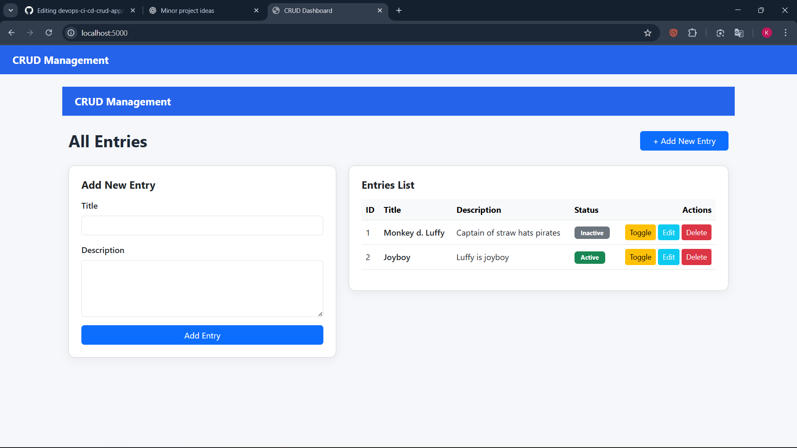

# 🚀 Flask CRUD App | Dockerized + CI Pipeline (GitHub Actions)

A simple and clean **Flask CRUD web application** containerized using **Docker** and automated with a **GitHub Actions CI Pipeline**.  
This project demonstrates the **core DevOps workflow**: version control → build automation → containerization → clean UI → working CRUD backend.

---

## 📌 Features

### 🔹 CRUD (Create, Read, Update, Delete)
- Add entries  
- Edit entries  
- Delete entries  
- Toggle status (Active/Inactive)

### 🔹 Modern UI
- Responsive Bootstrap UI  
- Clean card layout  
- Beautiful action buttons  
- Status badges  

### 🔹 Docker Integration
- Dockerfile included  
- Build and run in container  
- Port mapping for local testing  

### 🔹 CI Pipeline (GitHub Actions)
Automatically runs on each:
- **Push** to main  
- **Pull request**  
Pipeline performs:
- Checkout code  
- Setup Python  
- Install dependencies  
- Build Docker image  

---

## 🛠️ Tech Stack

| Layer | Technology |
|-------|-----------|
| Backend | Python (Flask) |
| Database | SQLite |
| UI | HTML, CSS, Bootstrap |
| DevOps | GitHub Actions |
| Container | Docker |
| Version Control | Git & GitHub |

---

## 📸 Dashboard Preview

---

## 🗂️ Project Structure

flask-crud-app/
│
├── app/
│ ├── crudapp.py
│ ├── models.py
│ ├── routes.py
│ └── templates/
│ ├── base.html
│ ├── content.html
│ ├── index.html
│ └── update.html
│
├── Dockerfile
├── requirements.txt
├── README.md
└── screenshots.png

---

## 🐳 Docker Usage

### 🔹 Build image
docker build -t flask-crud-app .

🔹 Run container
docker run -p 5000:5000 flask-crud-app

🔹 Browser
http://localhost:5000

⚙️ GitHub Actions CI Pipeline
name: CI Pipeline

on:
  push:
    branches: ["main"]
  pull_request:
    branches: ["main"]

jobs:
  build:
    runs-on: ubuntu-latest

    steps:
      - name: Checkout Code
        uses: actions/checkout@v3

      - name: Set up Python
        uses: actions/setup-python@v4
        with:
          python-version: "3.9"

      - name: Install Dependencies
        run: pip install -r requirements.txt

      - name: Docker Build
        run: docker build -t flask-crud-app .

▶️ How to Run Locally

1️⃣ Install dependencies
pip install -r requirements.txt

2️⃣ Run Flask app
python crudapp.py

3️⃣ Open in browser
http://localhost:5000